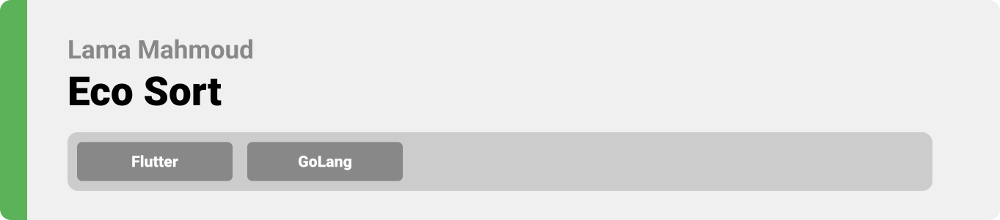
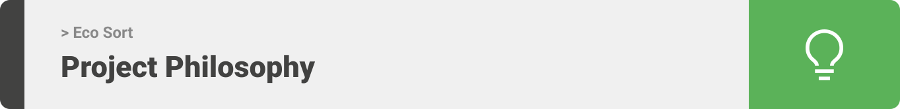
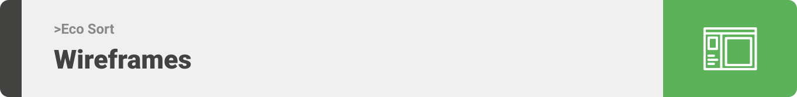
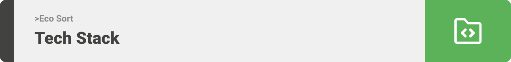
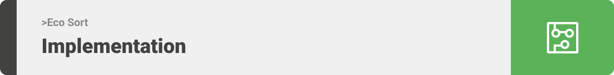
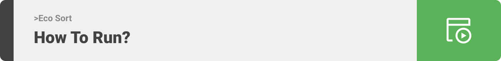

> Hello world! This is the project’s summary that describes the project plain and simple, limited to the space available. 


**[PROJECT PHILOSOPHY](https://github.com/julescript/well_app#-project-philosophy) • [WIREFRAMES](https://github.com/julescript/well_app#-wireframes) • [TECH STACK](https://github.com/julescript/well_app#-tech-stack) • [IMPLEMENTATION](https://github.com/julescript/well_app#-impplementation) • [HOW TO RUN?](https://github.com/julescript/well_app#-how-to-run)**

  

> This App aims to simplify the process of sorting and reuse as much resources as possible. 
>
> Farmers and Recyclers will be able to report factories, industries and companies that don't value nature or humans and violate their rights.
>
> Recyclers will be able to git rid of biodegradable wastes by issuing a recyling request. They can also dispose the other garbage and a team will be taking this garbage to recycle it.
>
> Farmers will get notifications about the places where Biodegradable wastes exist "food scrapes, paper, leftovers, rotten veggies..."
>
> Admins are responsible of handling non biodegradable recycling requests and complains.

### Users Stories
- As a recycler, I want to sort the biodegradable wastes, so that we can reduce the usage of chemical fertilizers
- As a recycler, I want to recycle plastics,metals,oil ...., so we can reuse the stuff and benefit from them again
- As a farmer, I want to produce organic fruits and vegetables, so I will search for biodegradable waste to feed my plants
- As an effective citizn, I wan to report the factories that don't abide by the laws set for nature protection, so I will complain about rules violation

  

> This design was planned before on paper, then moved to Figma app for the fine details.
Note that i didn't use any styling library or theme, all from scratch and using pure css modules

| Landing  | Complain  |
| -----------------| -----|
|  | |

| Handle Compalin | ChatBot  |
| -----------------| -----|
|  |  |

  

Here's a brief high-level overview of the tech stack the Well app uses:

- This project uses the [Flutter app development framework](https://flutter.dev/). Flutter is a cross-platform hybrid app development platform which allows us to use a single codebase for apps on mobile, desktop, and the web.
- For persistent storage (database), the app uses the [MongoDb](https://www.mongodb.com/docs/) package which allows the app to create a custom storage schema and save it to a local database.
- To send local push notifications, the app uses the [flutter_local_notifications](https://pub.dev/packages/flutter_local_notifications) package which supports Android, iOS, and macOS and [FireBase](https://www.googleadservices.com/pagead/aclk?sa=L&ai=DChcSEwjyspm62en4AhXlj2gJHUN_BWIYABAAGgJ3Zg&ohost=www.google.com&cid=CAESaOD20f8mO8OQ7oMYk_B54Q23emckfR-aZuHKbpAq6WMRJHgp_VkkHONnrw8jzT-j7U_CAGGY7LD7vqFQtDR71_CwEeplF0vbOcW3mD3CjgKU_iefF6Q2cWPBGdyTRFjJ8RTnbiOwa0z4&sig=AOD64_0mQAahwPRIod5AVGjQOrAEsjz5wA&q&adurl&ved=2ahUKEwiFo5K62en4AhVCr6QKHZ7GCZIQ0Qx6BAgCEAE) by using realtime database.
  - To assist users, the app uses [Dialog Flow](https://cloud.google.com/dialogflow) a chatbot system to 

  

> Uing the above mentioned tecch stacks and the wireframes build with figma from the user sotries we have, the implementation of the app is shown as below, these are screenshots from the real app

| Landing  | Complain  |
| -----------------| -----|
|  |  |

  

> This is an example of how you may give instructions on setting up your project locally.
To get a local copy up and running follow these simple example steps.

### Prerequisites

### Installation

_Below is an example of how you can instruct your audience on installing and setting up your app. This template doesn't rely on any external dependencies or services._

   
1. Clone the repo
2. 
3. 

